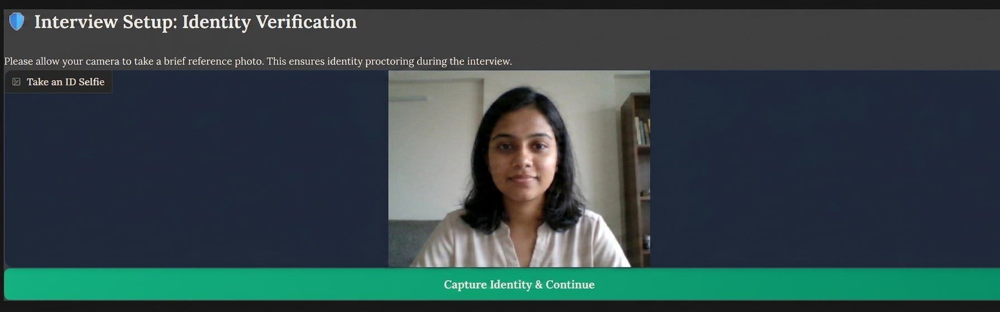
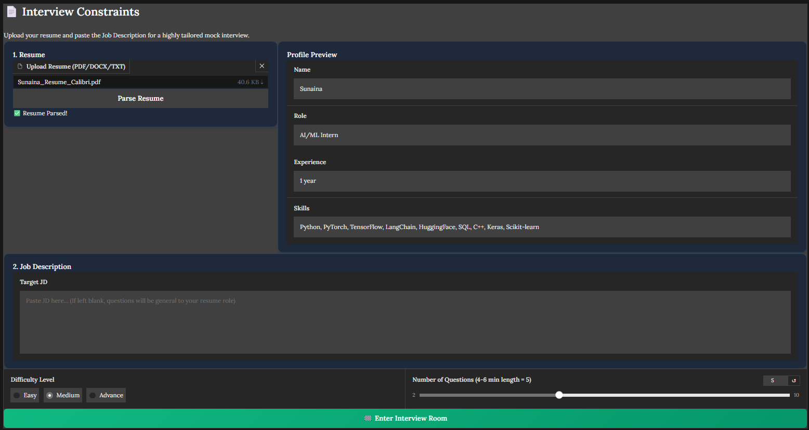
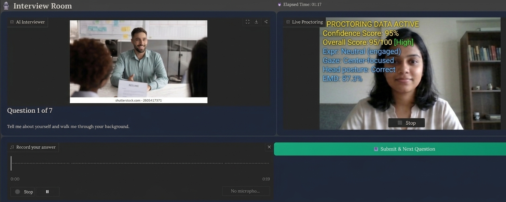
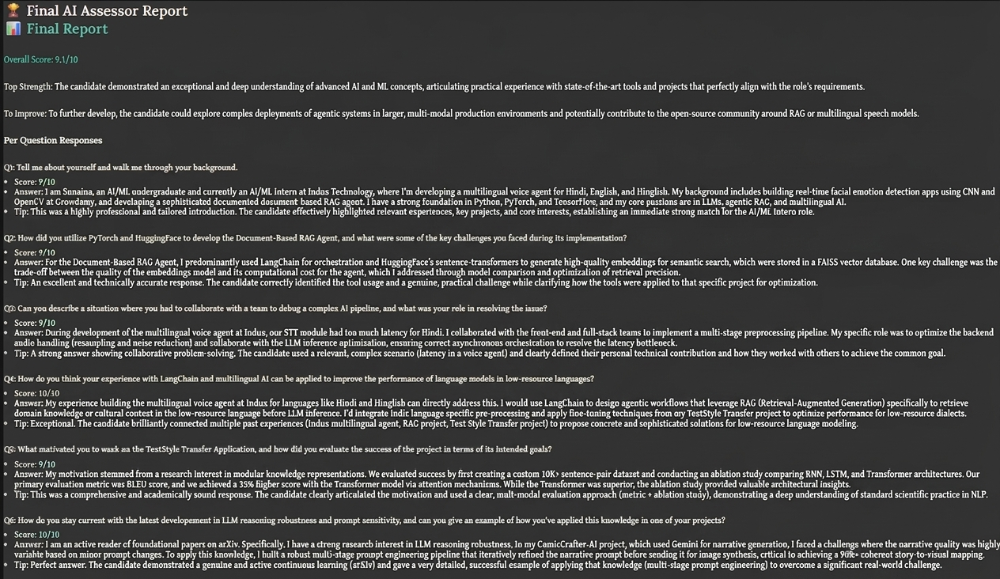

# 🎙️ AI Smart Mock Interview System

A fully automated, end-to-end AI mock interview system that watches your face, listens to your answers, speaks questions out loud, and gives you a detailed performance report — all running locally on your PC.

---

## 📌 What Does It Do?

This system conducts a **real mock interview** with you, from start to finish:

1. **Verifies your identity** using your webcam (so it can detect if someone else sits down later)
2. **Reads your resume** (PDF, DOCX, or TXT) and understands your background
3. **Generates personalised interview questions** based on your resume, a job description you paste in, and the difficulty you choose
4. **Asks you questions out loud** using Text-to-Speech so it feels like a real interviewer
5. **Listens to your spoken answers** using Speech-to-Text (via Groq Whisper API)
6. **Watches your face in real-time** — tracking your eye contact, expressions, head stability, and nervousness
7. **Scores every answer** using an AI judge
8. **Gives you a final report** with your overall score, strengths, weak areas, and tips

---

## 🖥️ Screens / Flow

The app is a 4-screen wizard:

```
[Screen 1] Identity Verification
      ↓  (take a selfie)
[Screen 2] Interview Setup
      ↓  (upload resume, paste JD, pick difficulty + number of questions)
[Screen 3] Interview Room
      ↓  (AI speaks questions, you record answers, live webcam analysis runs)
[Screen 4] Final Report
      (scores, strengths, tips per question)
```

---
## 🖼️ Screenshots

### Identity Verification


### Resume Parsing


### Interview Room


### Final Report


---

## 📁 Project Structure

```
interview_analyzer/
│
├── gradio_app.py            ← Main app — run this to start
├── main.py                  ← Older CLI version (for reference)
├── requirements.txt         ← All Python packages needed
├── .env                     ← Your API keys go here
├── face_landmarker.task     ← MediaPipe face model (auto-downloaded on first run)
│
└── modules/
    ├── tts.py               ← Text-to-Speech (speaks questions out loud)
    ├── stt.py               ← Speech-to-Text (transcribes your answers)
    ├── llm.py               ← AI brain (generates questions, evaluates answers)
    ├── resume_parser.py     ← Reads your resume and extracts your profile
    ├── face_landmarks.py    ← Detects your face and 478 facial landmarks (MediaPipe)
    ├── expression_detection.py ← Detects smile, nervousness, blink rate
    ├── eye_contact.py       ← Tracks if you're looking at the camera
    ├── head_pose.py         ← Detects if your head is tilted or turning
    ├── face_verify.py       ← Checks if the same person is in the camera throughout
    ├── fusion_scoring.py    ← Combines all signals into one confidence score
    ├── audio_confidence.py  ← Analyses voice pitch and energy (optional)
    └── interview_graph.py   ← LangGraph multi-agent interview flow (CLI version)
```

---

## ⚙️ Setup Instructions

### Step 1 — Install Python

Make sure you have **Python 3.10 or newer** installed.

### Step 2 — Install All Packages

Run this in your terminal inside the project folder:

```bash
pip install -r requirements.txt
pip install pyttsx3   # for low-latency offline text-to-speech
```

### Step 3 — Set Your API Key

Open the `.env` file and add your **Groq API key**:

```
GROQ_API_KEY=your_groq_api_key_here
```

> Get a free Groq API key at [console.groq.com](https://console.groq.com)

### Step 4 — Download the Face Model (one-time)

The app needs a MediaPipe face landmark model. **Download it once** before running:

```powershell
# Run this in your terminal inside the project folder
Invoke-WebRequest -Uri "https://storage.googleapis.com/mediapipe-models/face_landmarker/face_landmarker/float16/1/face_landmarker.task" -OutFile "face_landmarker.task"
```

> ⚠️ If you skip this step, the app will try to download it automatically at startup and will appear to hang for several minutes.

### Step 5 — Run the App

```bash
python gradio_app.py
```

Then open your browser and go to: **http://localhost:7860**

---

## 🔌 Key Technologies Used

| What it does | Technology |
|---|---|
| Web UI | [Gradio](https://www.gradio.app/) |
| AI (question generation, evaluation) | [Groq API](https://groq.com/) + Llama 3.3 70B |
| Speech-to-Text (your answers) | [Groq Whisper API](https://console.groq.com/) (whisper-large-v3-turbo) |
| Text-to-Speech (AI speaks questions) | [pyttsx3](https://pypi.org/project/pyttsx3/) (offline, fast) |
| Face detection + 478 landmarks | [MediaPipe](https://mediapipe.dev/) |
| Resume parsing | [pdfplumber](https://github.com/jsvine/pdfplumber) + Groq LLM |
| Multi-agent interview graph | [LangGraph](https://github.com/langchain-ai/langgraph) |
| Image processing | [OpenCV](https://opencv.org/) |

---

## 🧠 How the AI Works

### Question Generation
- Reads your resume (name, role, experience, skills, projects)
- Reads the job description you paste in
- Asks Llama 3.3 70B on Groq to generate tailored questions
- Always starts with *"Tell me about yourself"* and ends with *"Where do you see yourself in 5 years?"*
- Difficulty levels: **Easy**, **Medium**, **Advance**

### Answer Evaluation
After you submit each audio answer:
1. Your audio is sent to **Groq Whisper** for transcription
2. The transcript is sent to **Llama 3.3 70B** which gives:
   - A score out of 10
   - What you did well (strength)
   - One specific improvement tip

### Face Analysis (runs continuously during interview)
Every 0.5 seconds, the webcam feed is analysed:

| Signal | What it measures |
|---|---|
| Eye Contact | Are you looking at the camera? |
| Expression | Happy, Neutral, Nervous, Tense, Stressed |
| Head Stability | Is your head still or moving a lot? |
| Nervousness Score | Based on blink rate, lip compression, eyebrow raising |
| Confidence Score | Combined 0–100 score shown on screen |

### Identity Proctoring
At the start, it captures your face as a **reference embedding** (using histogram comparison). During the interview, if a different face appears in the webcam, it shows an alert: *"Face mismatch detected!"*

---

## 🎛️ Interview Settings

| Setting | Options | Default |
|---|---|---|
| Difficulty | Easy / Medium / Advance | Medium |
| Number of questions | 2 to 10 | 5 |
| Interview duration | ~1 min per question | ~5–6 min for 5 questions |
| Resume formats supported | PDF, DOCX, TXT, MD | — |

---

## 📊 Final Report Includes

- **Overall Score** (e.g. 7.5/10) — averaged across all questions
- **Top Strength** — what you consistently did well
- **Top Area to Improve** — your biggest gap
- **Weak Topics** — 2–3 specific areas to study
- **Final Tip** — one motivating, actionable sentence
- **Per-question breakdown** — score, your answer, improvement tip for every question

---

## 🚨 Common Issues & Fixes

### Port already in use
```
OSError: Cannot find empty port in range: 7860-7860
```
**Fix:** Kill the old process and restart:
```powershell
$p = (Get-NetTCPConnection -LocalPort 7860).OwningProcess
Stop-Process -Id $p -Force
python gradio_app.py
```

### App hangs at startup for several minutes
**Cause:** The `face_landmarker.task` model file is missing and is being downloaded.  
**Fix:** Download it manually first (see Step 4 in Setup above).

### No audio / TTS not working
**Cause:** `pyttsx3` might not be installed.  
**Fix:**
```bash
pip install pyttsx3
```

### Whisper transcription returns empty or gibberish
**Possible causes:**
- Your microphone volume is too low → check Windows sound settings
- Audio was completely silent → the system automatically skips silent audio now
- Network issue with Groq API → check your internet and `GROQ_API_KEY` in `.env`

### GROQ_API_KEY error
```
ValueError: GROQ_API_KEY not set in environment.
```
**Fix:** Make sure your `.env` file exists in the project root and contains:
```
GROQ_API_KEY=gsk_your_key_here
```

---

## 🗂️ Session History

After every completed interview, a JSON file is saved in the `sessions/` folder with:
- Full question and answer transcript
- Scores and feedback per question
- Final summary

These are timestamped so you can track your improvement over time.

---

## 🔒 Privacy Note

- Your webcam feed is **processed locally** — no video is uploaded anywhere.
- Your audio is sent to **Groq's API** for transcription (same as using a cloud speech service).
- Your resume text is sent to **Groq's API** for parsing and question generation.

---

## 📦 Quick Reference — All Commands

```bash
# Install dependencies
pip install -r requirements.txt
pip install pyttsx3

# Download face model (one-time)
# (Run in PowerShell inside project folder)
Invoke-WebRequest -Uri "https://storage.googleapis.com/mediapipe-models/face_landmarker/face_landmarker/float16/1/face_landmarker.task" -OutFile "face_landmarker.task"

# Start the app
python gradio_app.py

# Open in browser
# http://localhost:7860
```

---

*Built with ❤️ using Groq, MediaPipe, LangGraph, and Gradio.*
